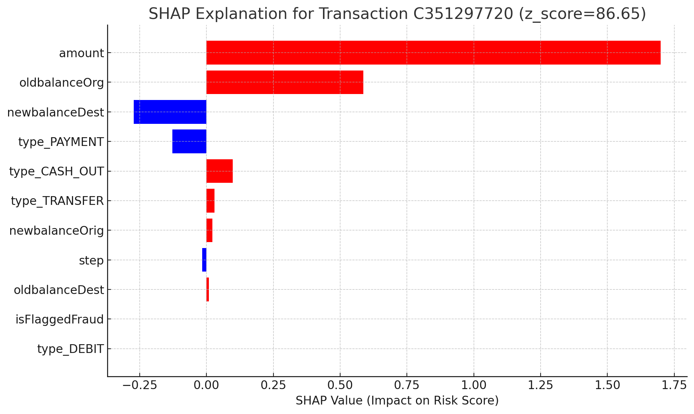
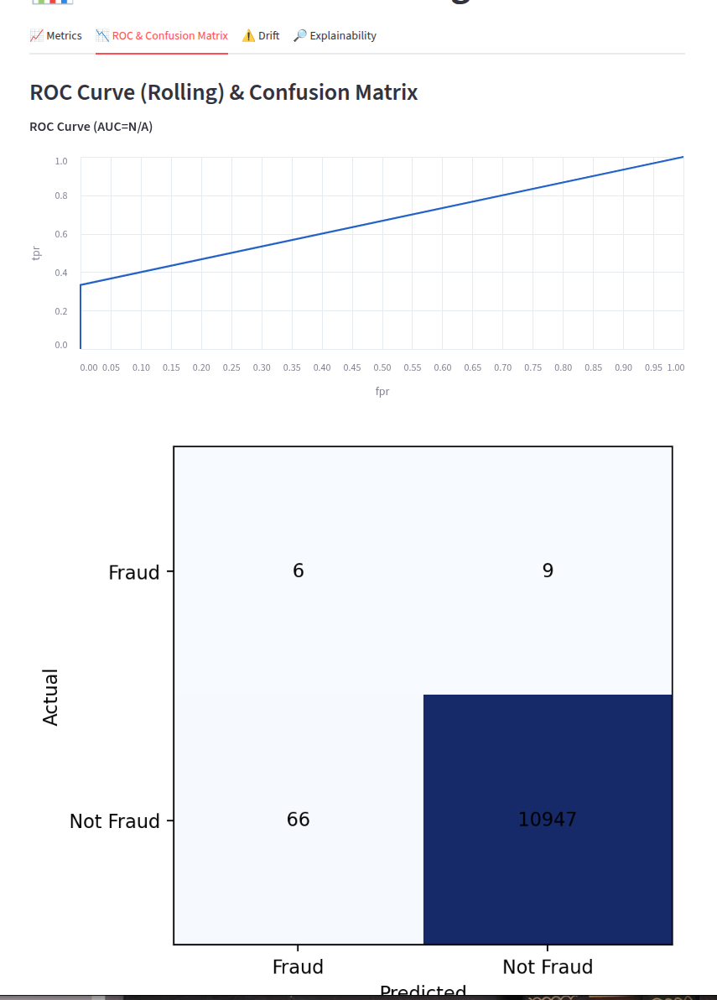
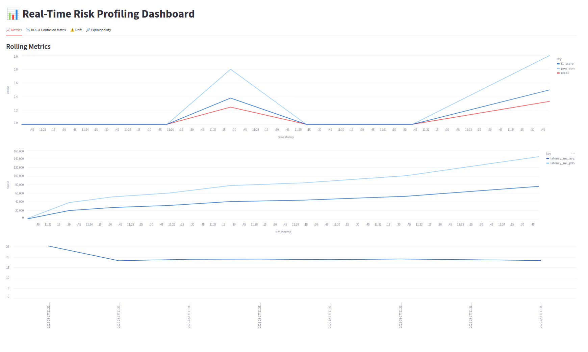

# 🛡️ Real-Time User Risk Profiling

### Unsupervised Anomaly Detection on Streaming Financial Data

> **Can we detect financial fraud without ever seeing a single labeled fraud example?**
>
> This system learns what "normal" looks like for each user — and flags anything that deviates — using a deep autoencoder trained exclusively on legitimate behavior. No labels needed.

**Author:** Mukund Kumar
**Supervisor:** Ashish Verma (PayPal)
**Institution:** BITS Pilani (MTech Dissertation, Sept 2025)

---

## 📌 The Problem

Digital payment platforms process billions of transactions daily. Traditional fraud detection relies on labeled datasets of historically fraudulent activities — which are:

- **Expensive and slow** to acquire
- **Blind to novel attack vectors** (zero-day threats)
- **Unable to adapt** as user behavior evolves over time

> **This system reframes the question:** instead of asking *"Is this fraud?"*, it asks *"Is this behavior unusual for this specific user?"* — a far more powerful approach when dealing with unseen threats.

---

## 🏗️ System Architecture

A **five-stage streaming pipeline** built on production-grade infrastructure:

```
 ┌──────────────┐     ┌─────────────────────┐     ┌───────────────────────┐
 │  PaySim CSV  │────▶│  Feature Engineering │────▶│  Apache Kafka         │
 │  (6.35M txns)│     │  & Kafka Producer    │     │  (transactions topic) │
 └──────────────┘     └─────────────────────┘     └───────────┬───────────┘
                                                              │
                                                              ▼
 ┌──────────────┐     ┌─────────────────────┐     ┌───────────────────────┐
 │  Streamlit   │◀────│  Kafka Topics       │◀────│  Spark Structured     │
 │  Dashboard   │     │  (alerts, explain,  │     │  Streaming            │
 │              │     │   metrics)          │     │  + PyTorch Autoencoder│
 └──────────────┘     └─────────────────────┘     │  + ADWIN Drift Detect │
                                                  │  + SHAP Explainer     │
                                                  └───────────────────────┘
```

| Stage | Component | What It Does |
|-------|-----------|-------------|
| **1. Ingest** | Kafka Producer | Reads transactions, publishes to `transactions` topic |
| **2. Process** | Spark Structured Streaming | Consumes events, applies feature transformations |
| **3. Detect** | PyTorch Autoencoder | Calculates per-transaction reconstruction error |
| **4. Score** | Stateful Z-Score (per-user) | Normalizes error against user's behavioral history |
| **5. Explain** | SHAP KernelExplainer | Generates feature-level explanations for flagged alerts |

---

## 🧠 How It Works

### Deep Autoencoder — Learning "Normal"

A symmetric 4-layer autoencoder (`11 → 128 → 64 → 32 → 64 → 128 → 11`) is trained **exclusively on legitimate transactions** (6.35M normal samples from PaySim). It learns to reconstruct normal behavior with low error — so when anomalous transactions arrive, the reconstruction error spikes.

**11 Input Features:**

| Raw Features | Encoded Features |
|---|---|
| `step`, `amount` | `type_CASH_OUT`, `type_DEBIT` |
| `oldbalanceOrg`, `newbalanceOrig` | `type_PAYMENT`, `type_TRANSFER` |
| `oldbalanceDest`, `newbalanceDest` | |
| `isFlaggedFraud` | |

**Training:** Adam optimizer (lr=1e-3), batch size 256, 2 epochs, StandardScaler preprocessing.

### Per-User Risk Scoring

Raw reconstruction error alone isn't enough — a high error for one user might be normal for another. The system maintains **per-user state** using Spark's `applyInPandasWithState`:

```
z_score = (error - user_mean) / user_std
```

- Rolling window of up to 100 transactions per user
- **Cold-start fallback:** new users (< 5 transactions) use global statistics
- Alert threshold: `z_score > 2.5`

### Concept Drift Detection (ADWIN)

User behavior changes over time — raises, seasonal spending, new habits. A static model would increasingly flag these as anomalous. The system uses **ADWIN (ADaptive WINdowing)** to:

1. Monitor each user's reconstruction error stream
2. Detect statistically significant distributional shifts
3. Reset the user's behavioral baseline on drift
4. Re-learn the "new normal" from subsequent transactions

| Drift Type | Example |
|-----------|---------|
| **Sudden** | New fraud technique deployed overnight |
| **Gradual** | Shift from in-store to online spending |
| **Incremental** | Income-driven spending increase |
| **Recurring** | Seasonal holiday shopping spikes |

### Explainability (SHAP)

Every flagged alert includes a **SHAP KernelExplainer** breakdown showing exactly which features drove the anomaly — critical for GDPR/DPDP Act compliance and analyst trust.

<p align="center">
  
</p>
<p align="center"><em>SHAP explanation for a flagged transaction (z_score = 86.65) — <code>amount</code> (+1.75) and <code>oldbalanceOrg</code> (+0.60) are the dominant risk drivers.</em></p>

---

## 📊 Results

### Detection Accuracy

Despite being trained **without any fraud labels**, the system demonstrates strong discriminative power on PaySim ground truth:

<p align="center">
  
</p>

| | Predicted Fraud | Predicted Not Fraud |
|---|:---:|:---:|
| **Actual Fraud** | 6 (TP) | 9 (FN) |
| **Actual Not Fraud** | 66 (FP) | 10,947 (TN) |

> The wide gap between fraud Z-scores (~86.65) and normal Z-scores (~0.42) demonstrates the model's ability to separate anomalous from legitimate behavior — remarkable for a fully unsupervised model.

### Throughput & Latency

<p align="center">
  
</p>

| Metric | Achieved |
|--------|----------|
| **P95 Latency** | < 200ms end-to-end |
| **Throughput** | ~1,200 transactions/sec |
| **Precision/Recall** | Evaluated against PaySim ground truth |

---

## 🛠️ Tech Stack

| Component | Technology | Role |
|-----------|-----------|------|
| Streaming | Apache Kafka 3.5.1 | High-throughput message broker |
| Processing | Apache Spark Structured Streaming | Stateful, distributed stream processing |
| Anomaly Detection | PyTorch 2.3.1 | Deep autoencoder model |
| Preprocessing | scikit-learn + joblib | Feature scaling and serialization |
| Drift Detection | river (ADWIN) | Concept drift monitoring |
| Explainability | SHAP | Feature-level explanations |
| Dashboard | Streamlit | Real-time monitoring UI |
| Infrastructure | Docker Compose | ZooKeeper + Kafka + Spark cluster |

---

## 🚀 Quick Start

### Prerequisites

- Docker and Docker Compose
- Python 3.8+
- 4GB+ RAM (8GB+ recommended)

### 1. Start Infrastructure

```bash
# Start all services (ZooKeeper, Kafka, Spark master/worker)
docker compose up -d --remove-orphans

# Verify containers are running
docker compose ps
```

### 2. Install Dependencies

```bash
pip install -r src/v1/requirements.txt
```

### 3. Run the Streaming Application

**Inside Docker (recommended):**

```bash
docker compose exec spark-master spark-submit \
    --packages org.apache.spark:spark-sql-kafka-0-10_2.12:3.5.1 \
    /home/n00b/workspace/Risk\ Profiling/src/v1/streaming_app_v5.py
```

**Locally:**

```bash
spark-submit --packages org.apache.spark:spark-sql-kafka-0-10_2.12:3.5.1 \
    src/v1/streaming_app_v5.py
```

### 4. Launch the Dashboard

```bash
KAFKA_BOOTSTRAP_SERVERS=localhost:29092 streamlit run src/v1/dashboard_v2.py
```

### 5. Simulate Concept Drift

```bash
docker compose exec spark-master python src/v1/producer_drift.py
```

This sends 55 normal transactions followed by 55 drifted transactions (5–35× amount increase) for a target user — watch the system detect the drift and generate alerts in real time.

---

## 📁 Project Structure

```
├── docker-compose.yml                 # Kafka + Spark + ZooKeeper infrastructure
├── src/v1/
│   ├── streaming_app_v5.py            # Main app: Spark + Kafka + Autoencoder + ADWIN
│   ├── producer.py                    # Transaction producer
│   ├── producer_drift.py              # Concept drift simulation
│   ├── dashboard_v2.py                # Streamlit monitoring dashboard
│   ├── X_train_sample.csv             # SHAP background data sample
│   └── requirements.txt              # Python dependencies
├── reports/blog/
│   ├── real-time-user-risk-profiling.md  # Detailed technical write-up
│   └── images/                        # Dashboard screenshots & SHAP plots
└── ppt/                               # Presentation slides
```

---

## ⚙️ Configuration

### Kafka Topics

| Topic | Purpose |
|-------|---------|
| `transactions` | Raw transaction events |
| `alerts` | Flagged high-risk transactions |
| `explanations` | SHAP explanations for alerts |
| `performance-metrics` | System performance metrics |

### Environment Variables

| Variable | Default | Description |
|----------|---------|-------------|
| `KAFKA_BOOTSTRAP_SERVERS` | `kafka:9092` | Kafka broker address (use `localhost:29092` for local) |

---

## 🔒 Privacy & Compliance

The system is designed with regulatory compliance as a first-class concern:

- **Privacy by Design** — operates on pseudonymized data; PII replaced with irreversible tokens
- **Data Minimization** — only essential behavioral signals processed (amounts, timing, session patterns)
- **Right to Explanation** — every flagged transaction includes SHAP explanations (GDPR / DPDP Act)
- **Auditability** — immutable logging of input features, model scores, and explanations
- **Fairness Auditing** — disparate impact analysis across user cohorts to detect demographic bias

---

## 🧩 Troubleshooting

<details>
<summary><strong>Checkpoint directory already exists</strong></summary>

```bash
rm -rf /tmp/spark_checkpoints_v5
```
</details>

<details>
<summary><strong>Kafka connection refused</strong></summary>

```bash
# Inside Docker containers: kafka:9092
# From host machine: localhost:29092
```
</details>

<details>
<summary><strong>Out of memory (OOM)</strong></summary>

```bash
docker compose exec spark-master spark-submit \
    --driver-memory 4g \
    --executor-memory 2g \
    src/v1/streaming_app_v5.py
```
</details>

---

## 💡 Lessons Learned

1. **Cold-start is real** — new users with no history need a sensible fallback. Using global statistics as a prior (instead of refusing to score) was critical for production viability.

2. **Stateful streaming is hard** — Spark's `applyInPandasWithState` is powerful but unforgiving. Serializing ADWIN detectors via `pickle` into the state store required careful handling.

3. **Unsupervised ≠ no evaluation** — just because the model doesn't use labels for training doesn't mean you skip evaluation. PaySim ground truth was essential for validation.

4. **Explainability is not optional** — in financial applications, a model that flags without explaining *why* is operationally useless. Analysts won't trust it, regulators won't allow it.

---

## 🔮 Future Directions

- **Online learning** — automatically fine-tune the autoencoder after drift events, not just reset the scoring baseline
- **Ensemble modeling** — combine autoencoder anomaly scores with Isolation Forests and One-Class SVMs
- **Cold-start improvement** — transfer learning from similar user cohorts to bootstrap new profiles
- **Enterprise integration** — production authentication, encryption at rest/in transit, SLA monitoring
- **Use-case expansion** — AML (Anti-Money Laundering), credit scoring, insurance fraud detection

---

## 📚 References

1. Zamanzadeh Darban, Z. et al. (2024). *Deep learning for time series anomaly detection: A survey*. ACM Computing Surveys.
2. Li, J. et al. (2023). *Autoencoder-based anomaly detection in streaming data with incremental learning and concept drift adaptation*. IJCNN.
3. Kumari, P. et al. (2024). *Concept drift challenge in multimedia anomaly detection*. Signal Processing: Image Communication.
4. Khan, W. A. and Abideen, Z. (2023). *Effects of behavioural intention on usage behaviour of digital wallet*. Future Business Journal.
5. Ribeiro, M. T. et al. (2016). *"Why Should I Trust You?": Explaining the predictions of any classifier*. ACM SIGKDD.
6. Lundberg, S. M. and Lee, S.-I. (2017). *A unified approach to interpreting model predictions*. NeurIPS.

---

## 📝 Dataset

**[PaySim](https://www.kaggle.com/datasets/ealaxi/paysim1)** — synthetic financial transaction dataset simulating mobile money transfers.

- **6,354,407** normal transactions (training) + **8,213** fraudulent transactions (evaluation only)
- Fields: `step`, `type`, `amount`, `nameOrig`, `oldbalanceOrg/Dest`, `newbalanceOrig/Dest`, `isFraud`, `isFlaggedFraud`

---

## 📄 License

This project is an academic research dissertation. Code is provided for educational and research purposes.
