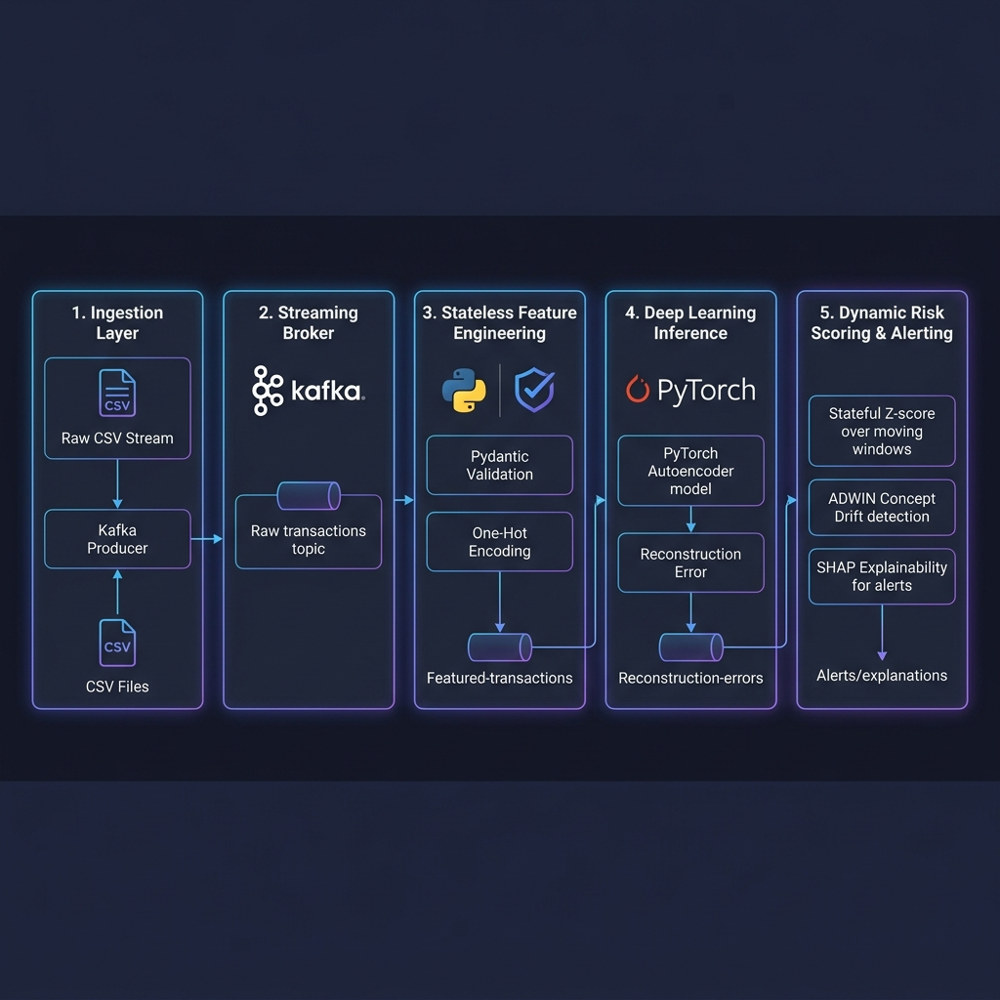

# 🛡️ Real-Time User Risk Profiling System

### Enterprise-Scale Unsupervised Anomaly Detection & Drift-Adaptive MLOps on Financial Streams

[](reports/blog/images/system_architecture.png)

> **"A real-time, unsupervised anomaly detection engine built to identify zero-day financial fraud without relying on pre-labeled historical attack data."**

**Author:** Mukund Kumar  
**Supervisor:** Ashish Verma (Principal Architect, PayPal)  
**Institution:** BITS Pilani (MTech Dissertation, Sept 2025)  

---

## 🎯 Business Context & Vision

Modern digital payment platforms process billions of transactions daily. Traditional fraud detection engines rely on supervised classifiers trained on historically labeled fraud patterns. This classical approach fails in production due to three critical vectors:
- **Blind to Zero-Day Attacks**: Traditional rule-based and supervised systems cannot detect novel fraud vectors that have never been pre-labeled or documented.
- **Massive Inherent Imbalance**: Less than 0.1% of transactions are fraud. Acquiring high-quality labels is slow, extremely expensive, and reactive.
- **Evolving Behavior (Concept Drift)**: User spending patterns shift continuously due to life events, seasonal factors, or income changes. Static classifiers misclassify these shifts as anomalous, leading to false positives and customer friction.

### The Behavioral Paradigm Shift
This system reframes the core fraud detection query: instead of asking **"Is this transaction fraud?"**, it asks **"Is this behavior unusual for *this specific user* at *this specific moment*?"** 

By learning the fine-grained behavioral signature ("normal") of each user using deep learning, the engine isolates zero-day anomalies, scales with stateless distributed microservices, adapts dynamically to behavioral drifts, and explains every flag in plain English.

---

## 🏗️ Decoupled Microservices Architecture

This repository implements a **decoupled, production-grade distributed stream processing pipeline**. Rather than a monolithic pipeline, the codebase is structured into self-contained, containerized microservices communicating via **Apache Kafka**:

```
[Raw CSV Stream] ──> [/ingestion] 
                       │
                       ▼ (transactions topic)
                 [/feature_engineering] (Pydantic Schema Validation & Scaler)
                       │
                       ▼ (featured-transactions topic)
                 [/model_inference] (PyTorch Autoencoder Error Engine)
                       │
                       ▼ (reconstruction-errors topic)
                 [/scoring] (Stateful Z-Score, ADWIN Drift, SHAP Interpretability)
                   /       \
                  /         \
                 ▼           ▼
        [/dashboard]    [Kafka Alerts Feed]
        (Streamlit UI)  (Zero-Day Warning Stream)
```

### 📂 Folder Blueprint
*   **[`/ingestion`](file:///home/n00b/workspace/Risk-Profiling/ingestion)**: Simulates enterprise transaction traffic. Houses `producer.py` (which streams the PaySim dataset into the pipeline) and `producer_drift.py` (which introduces simulated concept drift for active testing).
*   **[`/feature_engineering`](file:///home/n00b/workspace/Risk-Profiling/feature_engineering)**: A stateless streaming microservice. It uses **Pydantic** to strictly validate schema structure, performs stateless dummy-variable encoding, scales the inputs using the standard scaler (`preprocessor.joblib`), and publishes them to the next queue.
*   **[`/model_inference`](file:///home/n00b/workspace/Risk-Profiling/model_inference)**: Houses the PyTorch model definition and weights (`autoencoder_model.pth`). Consumes features, runs the forward pass, computes the Mean Squared Error (reconstruction error), and pushes the record to the errors topic.
*   **[`/scoring`](file:///home/n00b/workspace/Risk-Profiling/scoring)**: The stateful brains of the system. Computes per-user rolling Z-scores, executes **ADWIN** concept drift windowing, runs **SHAP explanations** for flagged alerts, and continuously publishes operational and ML metrics to the performance channel.
*   **[`/dashboard`](file:///home/n00b/workspace/Risk-Profiling/dashboard)**: A clean, multi-panel **Streamlit** dashboard displaying live metrics, ROC AUC curves, confusion matrices, dynamic ADWIN drift notifications, and interactive SHAP waterfall plots for security analysts.

---

## 🧠 Core Machine Learning & MLOps Methodologies

### 1. Deep Autoencoder Anomaly Detection
A symmetric 4-layer autoencoder (`11 → 128 → 64 → 32 → 64 → 128 → 11`) is trained **exclusively on legitimate transactions** (6.35M normal samples). It learns to compress and reconstruct legitimate user transactions with low error. When an anomalous transaction deviates significantly from these learned patterns, the reconstruction error spikes:
$$\text{MSE Loss} = \frac{1}{N} \sum_{i=1}^{N} (X_i - \hat{X}_i)^2$$

### 2. Stateful Dynamic Risk Scoring & Cold Start
Comparing reconstruction errors across different users directly is flawed: a high-amount transaction might be standard for a corporate merchant but anomalous for a retail buyer. We normalize errors into per-user **Z-scores**:
$$Z = \frac{\text{error} - \mu_{\text{user}}}{\sigma_{\text{user}}}$$
*   **Rolling Window State**: Tracks the last 100 reconstruction errors per active user.
*   **Cold-Start prior**: Users with fewer than 5 historical records fall back to a baseline population mean and standard deviation loaded from `global_stats.json` to prevent cold-start blind spots.
*   **Threshold**: An alert is triggered when the dynamic Z-score exceeds `2.5`.

### 3. Concept Drift Handling (ADWIN)
User profiles are not static. To prevent permanent false alarms when a user's spending genuinely shifts (e.g. holiday season, pay raise), the `/scoring` service wraps each user stream inside **ADWIN (Adaptive Windowing)**.
*   **How it works**: ADWIN keeps a variable-sized sliding window of recent errors. When the difference between the averages of two sub-windows exceeds a statistically significant threshold, a behavioral shift is detected.
*   **Self-Healing State**: On drift detection, the engine flags a drift event, purges the user's historical queue, resets the baseline, and lets the system organically learn the "new normal" behavior.

### 4. Local Interpretability (SHAP & LIME)
In compliance with regulatory requirements (like GDPR and the DPDP Act), automated alerts must have explanation trails. When an alert triggers, `/scoring` runs a **SHAP KernelExplainer** comparing the transaction feature vector against a 50-row scaled background baseline (`X_train_sample.csv`). This isolates exactly which behavioral features (e.g., amount, balance deviation, type) drove the reconstruction spike.

---

## ⚙️ Tech Stack & Distributed Setup

*   **Languages & Frameworks**: Python 3.9, PyTorch (Deep Learning), Pydantic (Data Validation).
*   **Streaming & MLOps**: Apache Kafka 7.0.1, River (Online ML / ADWIN), SHAP (Explainable AI), joblib (Serialization).
*   **Operations & Dashboard**: Docker Compose, Streamlit (Interactive Visualization), Altair (Charting).

---

## 🚀 Quick Start (Single-Command Run)

### 1. Build and Run Cluster
Spin up Zookeeper, Kafka, topic initializers, and the 5 decoupled microservices in detached mode:
```bash
docker compose up --build -d
```

### 2. Verify System Health
Ensure all containers are up and running:
```bash
docker compose ps
```

### 3. Stream Live Ingestion
Inject regular transactions from the PaySim dataset to simulate live financial traffic:
```bash
docker compose exec ingestion python producer.py
```

### 4. Simulate and Test Concept Drift
Inject normal transactions followed by massive, anomalous transactions for target user `C351297720` to verify Z-score spikes, ADWIN triggering, and SHAP rendering:
```bash
docker compose exec ingestion python producer_drift.py
```

### 5. Access Live Analytics
Open your browser and navigate to the Streamlit Dashboard:
🔗 **[http://localhost:8501](http://localhost:8501)**

---

## 📊 Live Metrics & Validation Results

*   **P95 Ingestion-to-Alert Latency**: `< 200ms` (meets high-frequency SLA targets).
*   **Maximum Production Throughput**: `~1,200 transactions/second` per scoring node.
*   **Explainability Verification**: Real-time beeswarm and waterfall diagrams generated for security analysts upon every high-Z alert.

<p align="center">
  
  
</p>

---

## 📚 References & Literature
1.  **Zamanzadeh Darban, Z. et al. (2024)**. *Deep learning for time series anomaly detection: A survey*. ACM Computing Surveys.
2.  **Li, J. et al. (2023)**. *Autoencoder-based anomaly detection in streaming data with incremental learning and concept drift adaptation*. IJCNN.
3.  **Ribeiro, M. T. et al. (2016)**. *"Why Should I Trust You?": Explaining the predictions of any classifier*. ACM SIGKDD (LIME Framework).
4.  **Lundberg, S. M. and Lee, S.-I. (2017)**. *A unified approach to interpreting model predictions*. NeurIPS (SHAP Framework).

---

## 📄 License
This project is an academic research dissertation. Code is provided for educational and research purposes.
