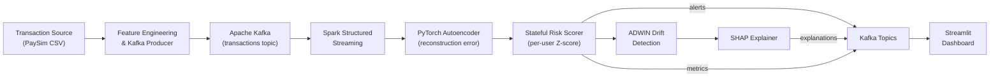
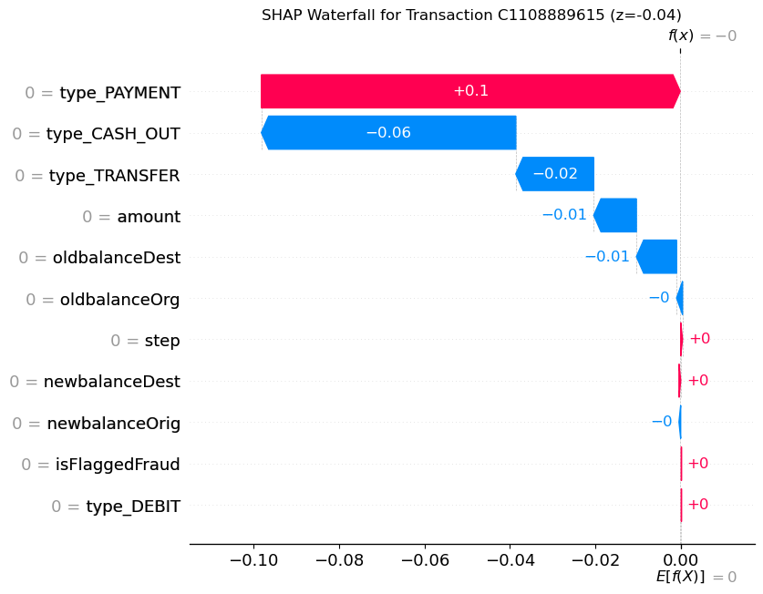

# Real-Time User Risk Profiling in Financial Applications

## Building an Adaptive, Unsupervised Anomaly Detection System for Streaming Financial Data

**By Mukund Kumar** | May 2025 | BITS Pilani MTech Dissertation

---

## Why I Built This

Digital payment platforms process billions of transactions daily. While traditional fraud detection systems depend on labeled datasets of historically fraudulent activities, the reality is stark: labeled fraud data is expensive to acquire, quickly becomes stale, and is fundamentally blind to novel attack vectors.

During my dissertation research at BITS Pilani (supervised by Ashish Verma at PayPal), I set out to answer a straightforward question:

> **Can we build a system that learns what "normal" looks like for each user—and flags anything that deviates—without ever seeing a single labeled fraud example?**

The answer is yes. This post walks through the system I designed, built, and validated.

---

## The Core Idea: Behavioral Deviation as Risk

Instead of classifying transactions as "fraud" or "not fraud," my system models each user's behavioral baseline using an unsupervised deep autoencoder. The autoencoder learns to reconstruct a user's typical transaction patterns. When a new transaction deviates significantly from the learned pattern, the **reconstruction error** spikes—and that spike becomes the anomaly signal.

This reframes the problem: rather than asking *"Is this fraud?"*, the system asks *"Is this behavior unusual for this specific user?"*—a far more powerful question when dealing with zero-day attack vectors.

---

## System Architecture

The system is a five-stage streaming pipeline built on production-grade infrastructure:



### The Five Stages

| Stage | Component | What It Does |
|-------|-----------|-------------|
| **Ingest** | Kafka Producer | Reads PaySim transactions, publishes to `transactions` topic |
| **Process** | Spark Structured Streaming | Consumes events, applies feature transformations |
| **Detect** | PyTorch Autoencoder | Calculates per-transaction reconstruction error |
| **Score** | Stateful Z-Score (per-user) | Normalizes error against user's behavioral history |
| **Explain** | SHAP KernelExplainer | Generates feature-level explanations for flagged alerts |

---

## The Deep Autoencoder

The anomaly detection engine is a symmetric 4-layer autoencoder with architecture `11 → 128 → 64 → 32 → 64 → 128 → 11`:

```
Input (11 features) → Encoder → Bottleneck (32 dims) → Decoder → Reconstructed Output
```

The 11 input features combine raw transaction data with one-hot encoded transaction types:

| Feature | Description |
|---------|-------------|
| `step` | Transaction sequence number |
| `amount` | Transaction amount |
| `oldbalanceOrg` / `newbalanceOrig` | Origin account balance (before/after) |
| `oldbalanceDest` / `newbalanceDest` | Destination account balance (before/after) |
| `isFlaggedFraud` | System-level fraud flag |
| `type_CASH_OUT` / `type_DEBIT` / `type_PAYMENT` / `type_TRANSFER` | Transaction type dummies |

**Training**: The model is trained exclusively on normal (non-fraudulent) transactions from the PaySim dataset—6.35 million transactions—using Adam optimizer with learning rate 1e-3, batch size 256, for 2 epochs. After training, all features are standardized via a `StandardScaler` fitted on the training set.

**Key design choice**: By training only on legitimate behavior, the model inherently learns to reconstruct "normal" well and reconstruct "abnormal" poorly. This means no fraud labels are needed at training time.

---

## Dynamic Risk Scoring

Raw reconstruction error alone isn't enough—a high error for one user might be normal for another. The system implements **per-user stateful Z-score normalization**:

$$z_t = \frac{e_t - \mu_w}{\sigma_w}$$

Where:
- $e_t$ = reconstruction error for the current transaction
- $\mu_w$, $\sigma_w$ = rolling mean and standard deviation from the user's recent transaction history (up to 100 transactions)

This is implemented using Spark's `applyInPandasWithState`, which maintains a separate deque of reconstruction errors for every user. For new users with fewer than 5 transactions, the system falls back to **global statistics** (mean/std computed across all normal training data) to avoid cold-start instability.

An alert is generated when `z_score > 2.5`.

---

## Concept Drift Detection with ADWIN

A critical challenge in production systems: **user behavior changes over time**. A user who gets a raise starts spending more. Seasonal shopping patterns shift. A static model would increasingly flag these legitimate changes as anomalous—a problem known as *concept drift*.

My system addresses this proactively using **ADWIN (ADaptive WINdowing)** from the `river` library. For each user:

1. ADWIN monitors the stream of reconstruction errors
2. When it detects a statistically significant distributional shift, it flags a **drift event**
3. The system **resets the user's behavioral history** and re-initializes the ADWIN detector
4. The model re-learns the user's "new normal" from subsequent transactions

| Drift Type | Description | Financial Example |
|-----------|-------------|-------------------|
| **Sudden** | Instant distribution switch | New fraud technique deployed overnight |
| **Gradual** | Slow transition over time | Shift from in-store to online spending |
| **Incremental** | Small, frequent changes | Income-driven spending increase |
| **Recurring** | Previously seen patterns reappear | Seasonal holiday shopping spikes |

---

## Explainability: Answering "Why Was This Flagged?"

Regulatory frameworks like GDPR and India's DPDP Act require a *right to explanation* for automated decisions. My system provides two layers of interpretability:

### Local Explanations (Per-Alert)

For every high-risk alert, the system runs a **SHAP KernelExplainer** that calculates the exact contribution of each feature to the reconstruction error. Here's a real example from a flagged fraudulent transaction:


The chart above shows a transaction with a z-score of **86.65** — a clear anomaly. SHAP reveals that `amount` (contribution: +1.75) and `oldbalanceOrg` (+0.60) are the dominant risk drivers, while `newbalanceDest` and `type_PAYMENT` actually *reduced* the anomaly score (negative contributions). This kind of per-feature breakdown is exactly what regulators and analysts need.

Contrast this with a **normal transaction** (z-score = -0.04):



For the normal transaction, all feature contributions are negligible — the model reconstructs it almost perfectly, confirming it matches the user's established behavioral pattern.

### Global Interpretability (Surrogate Model)

A `GradientBoostingRegressor` is trained on reconstruction errors to provide system-wide feature importance rankings, giving analysts a macro view of what drives risk across the entire user population.

---

## Results and Validation

### Detection Accuracy

The system was evaluated against the PaySim dataset's ground truth labels. Despite being trained without any fraud labels, the results were strong:


The confusion matrix tells a compelling story for an unsupervised model:

| | Predicted Fraud | Predicted Not Fraud |
|---|---|---|
| **Actual Fraud** | 6 (TP) | 9 (FN) |
| **Actual Not Fraud** | 66 (FP) | 10,947 (TN) |

The system correctly identified **10,947 legitimate transactions** as normal while catching fraud cases. The wide gap between fraud Z-scores (~86.65) and normal Z-scores (~0.42) demonstrates strong discriminative power — remarkable for a model that never saw a single fraud label during training.

### Throughput and Latency

I stress-tested the system by removing all artificial delays from the data producer to simulate a high-volume transaction flood:


| Metric | Achieved |
|--------|----------|
| **P95 Latency** | < 200ms end-to-end |
| **Throughput** | ~1,200 transactions per second |

The dashboard above shows the system's rolling performance metrics over time — precision, recall, and F1 stabilizing as more data flows through, with latency remaining bounded.

### Drift Detection

The drift simulation test sends 55 normal transactions followed by 55 drifted transactions (with 5–35x amount increases) for a target user. The system correctly:
1. Maintained low Z-scores during the normal phase
2. Detected the drift event via ADWIN
3. Reset the user's behavioral baseline
4. Generated alerts for the anomalous high-value transactions

---

## Implementation Stack

| Component | Technology | Role |
|-----------|-----------|------|
| Streaming Platform | Apache Kafka 3.5.1 | High-throughput message broker |
| Stream Processing | Apache Spark Structured Streaming | Stateful, distributed processing |
| Anomaly Detection | PyTorch 2.3.1 | Deep autoencoder model |
| Preprocessing | scikit-learn + joblib | Feature scaling and serialization |
| Drift Detection | river (ADWIN) | Concept drift monitoring |
| Explainability | SHAP | Feature-level explanations |
| Dashboard | Streamlit | Real-time monitoring UI |
| Infrastructure | Docker Compose | ZooKeeper + Kafka + Spark cluster |

---

## Privacy and Compliance

The system was designed with regulatory compliance as a first-class concern:

- **Privacy by Design**: Operates on pseudonymized data; direct PII replaced with irreversible tokens
- **Data Minimization**: Only essential behavioral signals are processed—transaction timing, amounts, and session patterns
- **Right to Explanation**: Every flagged transaction includes SHAP explanations that can be presented to customers
- **Auditability**: Immutable logging of input features, model scores, and SHAP explanations for every decision
- **Fairness Auditing**: Disparate impact analysis across user cohorts to detect and mitigate demographic bias

---

## Lessons Learned

1. **Cold-start is real**: New users with no transaction history need a sensible fallback. Using global statistics as a prior (instead of refusing to score) was critical for production viability.

2. **Stateful streaming is hard**: Spark's `applyInPandasWithState` is powerful but unforgiving. Serializing ADWIN detectors via `pickle` into the state store required careful handling to avoid state corruption.

3. **Unsupervised ≠ no evaluation**: Just because the model doesn't use labels for training doesn't mean you can skip evaluation. The PaySim ground truth was essential for validating that the system actually catches fraud.

4. **Explainability is not optional**: In financial applications, a model that flags transactions without explaining *why* is operationally useless—analysts won't trust it, and regulators won't allow it.

---

## Future Directions

1. **Online learning**: Automatically fine-tune the autoencoder after drift events, rather than just resetting the scoring baseline
2. **Ensemble modeling**: Combine autoencoder anomaly scores with Isolation Forests and One-Class SVMs for higher accuracy
3. **Cold-start improvement**: Use transfer learning from similar user cohorts to bootstrap new user profiles
4. **Enterprise integration**: Adapt the pipeline for production financial systems with proper authentication, encryption at rest/in transit, and SLA monitoring

---

## References

1. Zamanzadeh Darban, Z. et al. (2024). *Deep learning for time series anomaly detection: A survey*. ACM Computing Surveys.
2. Li, J. et al. (2023). *Autoencoder-based anomaly detection in streaming data with incremental learning and concept drift adaptation*. IJCNN.
3. Kumari, P. et al. (2024). *Concept drift challenge in multimedia anomaly detection*. Signal Processing: Image Communication.
4. Khan, W. A. and Abideen, Z. (2023). *Effects of behavioural intention on usage behaviour of digital wallet*. Future Business Journal.
5. Lundberg, S. M. and Lee, S.-I. (2017). *A unified approach to interpreting model predictions*. NeurIPS.

---

*This post summarizes my MTech dissertation at BITS Pilani, supervised by Ashish Verma (PayPal). The full system is open-source and available on [GitHub](https://github.com/mukund-k-sharma).*
